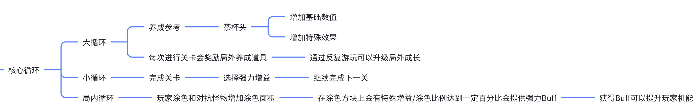

**关于"核心循环"的讨论**

  --------------------------------------------------------------
  Ver-1：26年3月5日

  --------------------------------------------------------------

**一句话总结**

*核心循环*是*[玩家一直能玩下去这个游戏的最小驱动单位]{.underline}*（个人理解，但是我觉得很准确）

**正文**

**1.为什么突然聊到这个**

在游戏整体设计中，常常会分析*核心循环*这一个概念。可是在我完成策划案《ColorPainter》的时候，第一步就遇到了这个难关：核心循环究竟是什么？\
我一开始做了以下的设计

{width="5.75in"
height="0.9270833333333334in"}

完成之后，我感到极度臃肿，我认为核心循环应该是可以通过一句话总结出来的。可是我遇到了一个难关，也就是本篇的核心问题：*核心循环*到底是什么？

**2.我的求解过程**

我先问了问我的朋友：

  --------------------------------------------------------------
  核心循环主要是局内玩法，而我上面的大循环主要是局外养成

  --------------------------------------------------------------

一下子砍掉了一大截，也让我开始认真审视核心循环这个概念。

然后，我又去大佬的群里问了问，然后就有了文章末尾的聊天

其中提炼出来的重点（揉杂大量个人理解，因为大家的观点各有不同）有下面几点：

核心循环是在游戏规则的引导下对玩家行为的抽象

如果核心循环缺失，玩家没有游玩动力（体验缺失）

不一定不可切割（大部分情况下可以被分为更小的循环）

但是，此时一个大佬给出了一个关键的建议

  ----------------------------------------------------------------------------
  以及我认为，核心循环并不是挖掘的重点，一款玩法明确的游戏，核心循环非常清晰
  。感觉核心循环，更多是作为一个分析更多系统、循环的工具
  。它和游戏的整体目标必须一起讨论，才能比较好的分析每个系统和子循环的作用 。

  ----------------------------------------------------------------------------

这个观点结束了大家的讨论，也点出了我的问题：太过于拘泥核心循环的定义，没有将其放在这个游戏的设计中一起讨论。

或许，在游戏的策划内容中大部分的内容都不是需要在一开始就定好的，大部分的内容都需要在设计的过程中一点点细化和改变，以达到一个较为良好的答案。

*~~怎么感觉这篇是完全的废话......~~*

总之，这是我的第一篇总结，就停笔（键盘）于此了

**完整聊天记录**

**💬
重构后的聊天记录（对话有很多缺漏,同时删掉了部分不影响上下文的无关对话，前面用户标记仅为方便查看，不代表真实关系）**

● \[用户\]：去掉任何其中一环的时候游戏无法循环 。这说明够核心了 。

● \[用户\]：🤔 我了解的很少，这个游戏无法循环是指玩家感觉没有玩的欲望吗
？

● \[用户\]：循环有正反馈循环和负反馈循环
。正反馈循环就是你玩的时候做了A，游戏反馈给了你B，这个B能促进你更好地去做A
。从而产生循环，推进你达成游戏的目标
。负反馈循环常用来插入正反馈循环，打造体验的变化
。例如你对丝之歌很熟，你可以分析一下他在开图过程中是什么循环 。

● \[用户\]：🤔
先到达某处------解决某些事情------允许你解锁某处------到达某处------解决某些事情
。

● \[用户\]：嗯
。再例如战斗，主动攻击------获取丝线------使用丝线------主动攻击
。这种是很基础的循环 。

● \[用户\]：这个就是循环 ？噢 。

●
\[用户\]：玩家在进行游戏的时候，为了达到一个目标，因为系统机制的设计，导致通常会重复做几件事情
。这个就是循环设计 。

● \[用户\]：所以一个游戏的核心循环可以有多个 ？

● \[用户\]：不对吧 。这个不能用数字来论吧） 。就是总结出来的话（ 。

● \[用户\]：这个我大概能理解 。我想不出来，没有尝试想过 。

● \[用户\]：然后，系统通常可以连接成为循环
。系统最简单的定义就是输入------系统（机制）------输出
。例如输入攻击------（机制）------输出丝绸 。核心循环只能有一个
。除此外都是其他循环 。

● \[用户\]：soga 。

● \[用户\]：B讲的是循环的概念，不是核心循环的概念 。

● \[用户\]：确实不懂多核心，有没有栗子 ？我要学 。

●
\[用户\]：我之前想过丝之歌的核心循环，但是总感觉不够核心，帮忙纠正一下呗：探索\-\--增强战斗能力\-\--打败特定Boss\-\--增加可探索区域
。或者也许以前看别人教学的时候看过，但认识不深 。

●
\[用户\]：超级马里奥的核心循环应该就是:开始游戏，跑酷，分支，死亡或者下一关，分支，判断是否游戏胜利，游戏结束，游戏重新开始
。

● \[用户\]：我觉得这个说法和实际的体验有点不符合 。

● \[用户\]：差不多其实，可以打磨，不过就这个意思 。

● \[用户\]：oh 。

●
\[用户\]：这个指的是每一个单独关卡的核心循环对吧（不过马里奥其实也就关卡是它的真正内容而已了
。

● \[用户\]：我大概有一点点粗浅的理解这是个什么玩意了 。

● \[用户\]：核心循环肯定不能体现所有体验，体验是缺失的
。所以也能当作是整个游戏的核心循环
。因为他的目的是展示游玩的一个顺序，一个流程 。

● \[用户\]：🤔

● \[用户\]：其他循环就是关卡中具体干了啥
。这个有点像关卡设计的框架，起点，目标 。阻碍、细分目标
。但是核心循环不需要管你关卡内干了啥，死亡条件 。这几个组合起来就是框架
。不需要关心具体的细节目标如何实现 。

● \[用户\]：我觉得核心循环的本质是一种对玩家行为与游戏玩法的抽象化提炼
。

● \[用户\]：系统之间应该是嵌套关系，也可以是连接，感觉循环的思路也是这样
。

●
\[用户\]：根本目的是解释说明这款游戏里面，玩家主要是为了什么目标，在什么框架下进行重复的抽象行为
。

●
\[用户\]：能不能粗浅的理解为，玩家最开始为什么愿意玩这个游戏，在没有任何积累的情况下
？

● \[用户\]：不太能 。我认为玩家开始出现循环是因为出现了机制 \[捂脸\] 。

● \[用户\]：\[捂脸\]和循环有啥关系
。如果我还没了解过这个游戏，我觉得他只是一个游戏的目标能不能吸引玩家而已
。

● \[用户\]：\[打脸\] 并没有进入循环 。循环是持续玩，开始玩是入口
。和玩家有关的是，核心循环缺失，会导致玩家没法一直玩 。

● \[用户\]：丝之歌核心循环是rpg模版\[捂脸\]
接任务---做任务---完成任务---接下个任务
。我的表达有问题，在我看来，他核心循环并不是银河恶魔城那一套（ 。

●
\[用户\]：应该说玩家开始体验了游戏的玩法之后为什么愿意留在这个游戏，不过看起来也不对
。

●
\[用户\]：因为游戏就是一个用于创造体验的引擎，每一个元素、元素的关系，都会引起不同的体验，将创造核心体验的部分提炼出来，再将其解释为一个可根据玩家行为重复连接的模型，就是核心循环
。

●
\[用户\]：或者说，他在银河恶魔城的循环上面封装了一层RPG的循环，嗯，好让很多没有接触过类银的玩家去更快的上手
。

● \[用户\]：可能是我用一代的思维玩的（？ 。

●
\[用户\]：我体验中，（除了第三幕）任务反而是比较不占重要的部分，第三幕的rpg的任务感受才强烈，前面的任务更像是指引或者是支线？

●
\[用户\]：以及我认为，核心循环并不是挖掘的重点，一款玩法明确的游戏，核心循环非常清晰
。感觉核心循环，更多是作为一个分析更多系统、循环的工具
。它和游戏的整体目标必须一起讨论，才能比较好的分析每个系统和子循环的作用
。当然也不能以一概全，对于AVG这类叙事主导的游戏，本身的系统玩法是很简单的，不建议太拘泥于寻找循环的概念，它最好是一个工具了
。

●
\[用户\]：在hit教纲，游戏底层逻辑是这样的，核心体验---核心玩法---核心循环---核心系统
。

● \[用户\]：好吧，是我钻了牛角尖（ 。

● \[用户\]：所以说，必须得先讨论目标或者说核心体验是什么 。

● \[用户\]：这样，对，明白了 。文字冒险游戏也是有核心循环的
。对话---选择---新剧情---对话 。游戏设计的第一性原则，从体验出发 。

●
\[用户\]：本质上是剧情驱动吧，玩家做选择是为了看到不同选择的剧情，而剧情也吸引着玩家去做出自己的决定
。

●
\[用户\]：对的，不过这种就简单到没有分析的必要了，AVG的核心体验还是来源于故事与演出
。

●
\[用户\]：我想说的主要是循环，它是游戏的底层逻辑，或者说玩家一直能玩下去这个游戏的最小驱动单位
。玩家一直能玩下去这个游戏的最小驱动单位 。

● \[用户\]：这个说的理解了 。

● \[用户\]：因为他是制作人设计游戏的时候第一个考虑的循环
。就像一款游戏的类型一样，再普通的玩家都能基本说准确它的类型
。策划后续的深入设计，都基于这个框架；你作为拆解的，也最先抓住这个框架，然后基于这个框架
。
